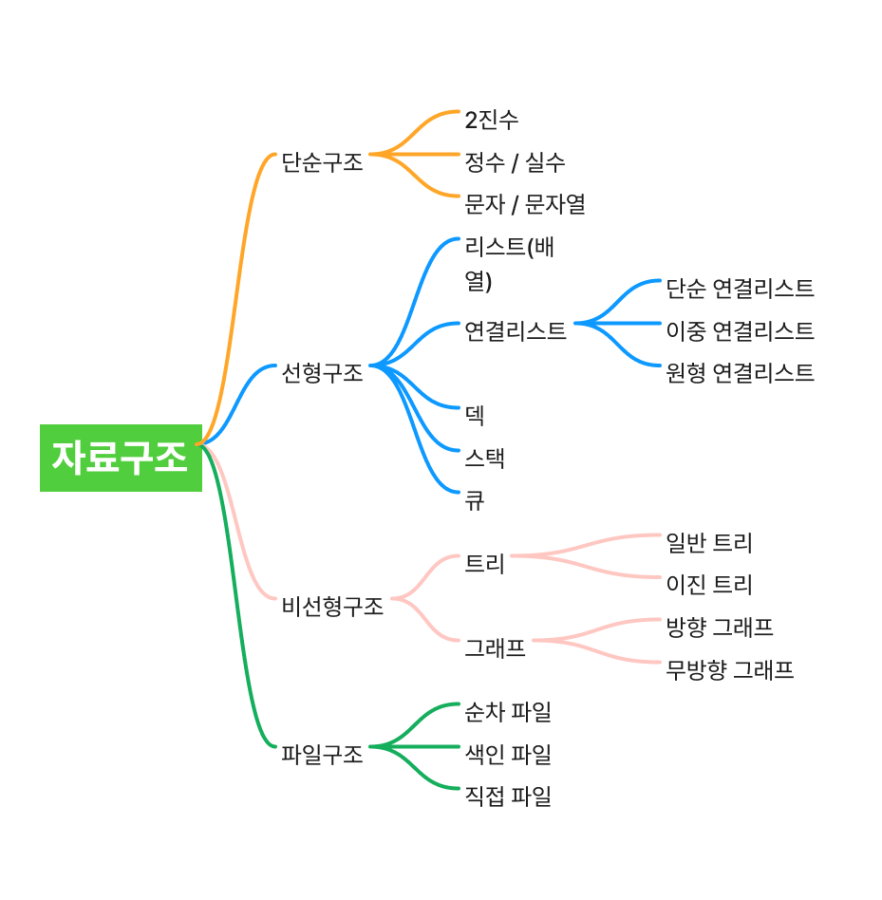
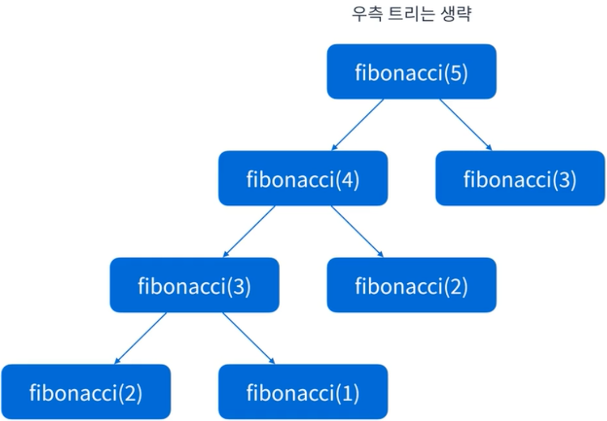
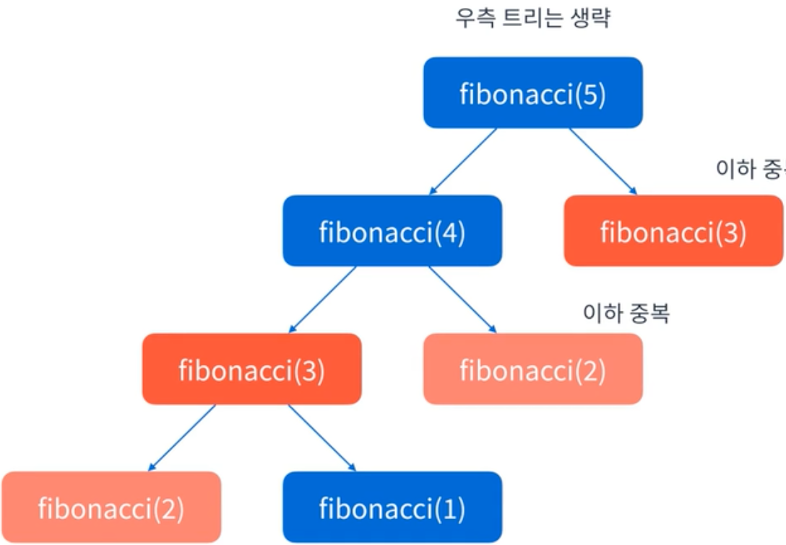

# 개요

알고리즘 문제 풀이와 자료구조&알고리즘 패턴 이론 공부



- [시간 복잡도](/docs/시간복잡도/index.md)

## 알고리즘 패턴

- [슬라이딩 윈도우](/docs/AlgorithmPatterns/슬라이딩%20윈도우.md)
- [투포인터(Two Pointers)](/docs/AlgorithmPatterns/투포인터/index.md)
- greedy
- 해시
- 스택/큐
- 정렬
- 완전탐색
  - 깊이 우선탐색(DFS)
  - 너비 우선탐색(BFS)
- 이분탐색
- 그래프

## 방식

- 동적계획법(DP)
- [GCD, LCM](/docs/AlgorithmPatterns/GCD,%20LCM.md)
- [소수구하기](/docs/AlgorithmPatterns/소수구하기/index.md)
- [참고](/docs/ref.md)

<br/>
<br/>
<br/>

# 개념정리

## 1. 스택(Stack)

### 개념

마지막에 들어간 것이 가장 먼저 나오는 구조 (LIFO: Last In, First Out) <br/>
e.g) 브라우저 뒤로가기

### JS 내장 메소드

- push()
  - 맨 뒤에 원소 추가
  - 원본 배열이 바뀜
- pop()
  - 맨 뒤에 원소 꺼내기
  - 원본 배열이 바뀜

> 🔅참고🔅 <br/>
> stack.peek(); => Java 메서드, 맨 위 값만 확인 <br/>
> stack.top(); => C++ 메서드, 맨 위 값만 확인

```js
const stack = [];
stack.push(1); // 넣기
stack.push(2);
console.log(stack.pop()); // 2
console.log(stack.pop()); // 1
```

## 2. 큐(Queue)

### 개념

먼저 들어간 것이 먼저 나옴 (FIFO: First In, First Out) <br/>
→ 대기열, 프린터 문제 등에서 사용

### JS 내장 메소드

- shift()
  - 맨 앞에 원소 꺼내기
  - 원본 배열이 바뀜

```js
const queue = [];
queue.push(1);
queue.push(2);
console.log(queue.shift()); // 1
console.log(queue.shift()); // 2
```

## 3. 해시(Hash)

### 개념

- 키(key) → 값(value) 을 빠르게 매핑(저장/검색) 하기 위한 방식
- 키를 해시 함수로 변환해서 빠르게 값에 접근하는 방식
- Map, Object, Set 해시 테이블을 기반으로 동작

## 4. 힙(Heap)

### 개념

가장 큰 값 또는 가장 작은 값을 아주 빠르게 꺼낼 수 있도록 만든 특별한 트리 기반 자료구조

- JS에는 내장 힙이 없어서 보통 PriorityQueue 직접 구현해야 함
- 레벨2~3부터 힙을 써야 하는 문제(예: "더 맵게")가 나옴
- 항상 최소/최대 값을 O(log n)에 꺼낼 수 있는 구조

## 5. 정렬(Sorting)

### 개념

데이터를 특정 기준으로 순서대로 나열

### 자주 쓰는 정렬 알고리즘

- 버블/삽입/선택 정렬: 기본적인 O(n²) 알고리즘 (학습용)
- 퀵/병합 정렬: O(n log n), 실제로 많이 씀

### JS 내장 메소드

- sort()

```js
const arr = [3, 1, 4, 2];
arr.sort((a, b) => a - b); // [1,2,3,4]
```

### 자주 출제 되는 문제

- "가장 큰 수" 문제 (숫자 정렬 응용)
- "K번째 수" 문제

## 6. 동적 계획법(DP: Dynamic Programming)

### 개념

- 큰 문제를 작은 문제로 쪼개서 풀고, 그 결과를 저장해두는 방법<br/>
핵심은 **중복 계산을 줄인다** (메모이제이션, 테이블)
- 특정 알고리즘이 아니라 문제 해결 방식을 의미
- 크게는 메모이제이션과 타뷸레이션 방식

## 사례

- [프로그래머스- 땅따먹기](https://github.com/hyeseon-han/algorithm/tree/main/%ED%94%84%EB%A1%9C%EA%B7%B8%EB%9E%98%EB%A8%B8%EC%8A%A4/2/12913.%E2%80%85%EB%95%85%EB%94%B0%EB%A8%B9%EA%B8%B0)
- [정수 삼각형](https://github.com/hyeseon-han/algorithm/tree/main/%ED%94%84%EB%A1%9C%EA%B7%B8%EB%9E%98%EB%A8%B8%EC%8A%A4/3/43105.%E2%80%85%EC%A0%95%EC%88%98%E2%80%85%EC%82%BC%EA%B0%81%ED%98%95)
- [등굣길](https://github.com/hyeseon-han/algorithm/tree/main/%ED%94%84%EB%A1%9C%EA%B7%B8%EB%9E%98%EB%A8%B8%EC%8A%A4/3/42898.%E2%80%85%EB%93%B1%EA%B5%A3%EA%B8%B8) (상향식)
- [2 x n 타일링](https://github.com/hyeseon-han/algorithm/tree/main/%ED%94%84%EB%A1%9C%EA%B7%B8%EB%9E%98%EB%A8%B8%EC%8A%A4/2/12900.%E2%80%852%E2%80%85x%E2%80%85n%E2%80%85%ED%83%80%EC%9D%BC%EB%A7%81) (피보나치)
- [멀리뛰기](https://github.com/hyeseon-han/algorithm/tree/main/%ED%94%84%EB%A1%9C%EA%B7%B8%EB%9E%98%EB%A8%B8%EC%8A%A4/2/12914.%E2%80%85%EB%A9%80%EB%A6%AC%E2%80%85%EB%9B%B0%EA%B8%B0)

### 자주 쓰는 정렬 알고리즘
피보나치 수열

- 재귀 => 비효율

  ```js
  function fib(n) {
    if (n <= 1) return n;
    return fib(n - 1) + fib(n - 2);
  }
  ```

- DP => 효율적

  ```js
  function fib(n) {
    const dp = [0, 1];
    for (let i = 2; i <= n; i++) {
      dp[i] = dp[i - 1] + dp[i - 2];
    }
    return dp[n];
  }
  ```

### 구현 방식

#### 타뷸레이션(Tabulation)

- 상향식(Bottom-Up)
- 필요한 값들을 미리 계산해두는 것

#### 메모이제이션(Memoization)

- 하향식(top-down)
- 재귀 사용
- 이미 계산한 값은 저장해서 재사용


백트래킹을 이용한 피보나치 수열 구현은 중복된 연산이 너무 많다.

따라서 이미 해결한 문제는 기록해주자 (=메모이제이션)


> 출처
> https://lazyhysong.tistory.com/entry/JS-%EB%8F%99%EC%A0%81-%EA%B3%84%ED%9A%8D%EB%B2%95-Dynamic-Programming


## 7. 탐욕법(Greedy)

### 개념

- 매 순간 "지금 가장 좋아 보이는 선택"을 해서 최적해를 구하는 방법
- 현재 상황에서 가장 좋아 보이는 것만을 선택하는 알고리즘
- 기준에 따라 좋은 것을 선택하는 알고리즘

### 자주 출제 되는 문제

- 거스름돈 문제 (큰 동전부터 차례대로 줌)
- 프로그래머스 “체육복” 문제 (앞뒤 학생에게만 빌려줌)

### 사례

- [increasing-triplet-subsequence](https://github.com/hyeseon-han/algorithm/tree/main/LeetCode/0334-increasing-triplet-subsequence)
- [단속카메라](https://github.com/hyeseon-han/algorithm/tree/main/%ED%94%84%EB%A1%9C%EA%B7%B8%EB%9E%98%EB%A8%B8%EC%8A%A4/3/42884.%E2%80%85%EB%8B%A8%EC%86%8D%EC%B9%B4%EB%A9%94%EB%9D%BC)

// TODO

- [체육복]()
- [조이스틱]()
- [큰 수 만들기]()
- [구명보트]()
- [섬 연결하기]()


## 8. 완전탐색(Brute Force)

### 개념

가능한 모든 경우의 수를 전부 확인해서 정답을 찾는 방법.

## 9. 깊이/너비 우선 탐색 (DFS / BFS)

### 개념

- DFS (Depth First Search): 한 갈래를 끝까지 들어갔다가 막히면 돌아와서 다른 갈래 탐색. (스택/재귀로 구현)
- BFS (Breadth First Search): 시작점에서 가까운 노드부터 차례로 탐색. (큐로 구현)

### 자주 출제 되는 문제

- 미로 찾기 → BFS
- 트리 순회 → DFS

### 사례

- [게임 맵 최단거리](https://github.com/hyeseon-han/algorithm/tree/main/%ED%94%84%EB%A1%9C%EA%B7%B8%EB%9E%98%EB%A8%B8%EC%8A%A4/2/1844.%E2%80%85%EA%B2%8C%EC%9E%84%E2%80%85%EB%A7%B5%E2%80%85%EC%B5%9C%EB%8B%A8%EA%B1%B0%EB%A6%AC)
- [단어 변환](https://github.com/hyeseon-han/algorithm/tree/main/%ED%94%84%EB%A1%9C%EA%B7%B8%EB%9E%98%EB%A8%B8%EC%8A%A4/3/43163.%E2%80%85%EB%8B%A8%EC%96%B4%E2%80%85%EB%B3%80%ED%99%98)


```js
// DFS 예시 (재귀)
function dfs(node, visited, graph) {
  visited[node] = true;
  for (let next of graph[node]) {
    if (!visited[next]) dfs(next, visited, graph);
  }
}

// BFS 예시 (큐)
function bfs(start, graph) {
  const visited = Array(graph.length).fill(false);
  const queue = [start];
  visited[start] = true;

  while (queue.length) {
    const node = queue.shift();
    for (let next of graph[node]) {
      if (!visited[next]) {
        visited[next] = true;
        queue.push(next);
      }
    }
  }
}
```

#### [DFS]

DFS와 다르게 복구 할 필요 없음
DFS 에서는 한 경로를 끝까지 파고들기 때문에 나중에 더 짧은 경로가 나올 수도 있어서 복구를 해야하지만 BFS인 경우에는 복구 할 필요 없음.

```js
visited[x][y] = true;
// ...
visited[x][y] = false; // 백트래킹 시 복구
```

왜냐하면 가까운 거리 → 먼 거리 순으로 가기 때문에 한번 방문 했으면 최단거리 계산 끝났다고 판단

## 10. 이분탐색(Binary Search)

### 개념

정렬된 배열에서 원하는 값을 빠르게 찾는 방법. <br/>
범위를 절반씩 줄여가면서 탐색 (O(log n)).

```js
function binarySearch(arr, target) {
  let left = 0,
    right = arr.length - 1;
  while (left <= right) {
    const mid = Math.floor((left + right) / 2);
    if (arr[mid] === target) return mid;
    if (arr[mid] < target) left = mid + 1;
    else right = mid - 1;
  }
  return -1;
}
```

### 자주 출제 되는 문제

- 숫자 맞추기 게임 (업다운)

## 11. 그래프(Graph)

### 개념

정점(node)과 간선(edge)으로 이루어진 자료구조.

**종류**

- 방향 그래프 / 무방향 그래프
- 가중치 그래프 (거리, 비용이 있음)

**표현 방법**

- 인접 행렬: 2차원 배열
- 인접 리스트: 배열 안에 연결된 노드 목록

### 자주 출제 되는 문제

- 네트워크, 친구 관계, 도로 지도

> https://www.codetree.ai/blog/%EC%95%8C%EA%B3%A0%EB%A6%AC%EC%A6%98%EA%B3%BC-%EC%9E%90%EB%A3%8C%EA%B5%AC%EC%A1%B0-%EC%B0%A8%EC%9D%B4-%EA%B0%9C%EB%85%90%EA%B3%BC-%EC%A2%85%EB%A5%98-%ED%95%99%EC%8A%B5-%EB%B0%A9%EB%B2%95%EA%B3%BC/
