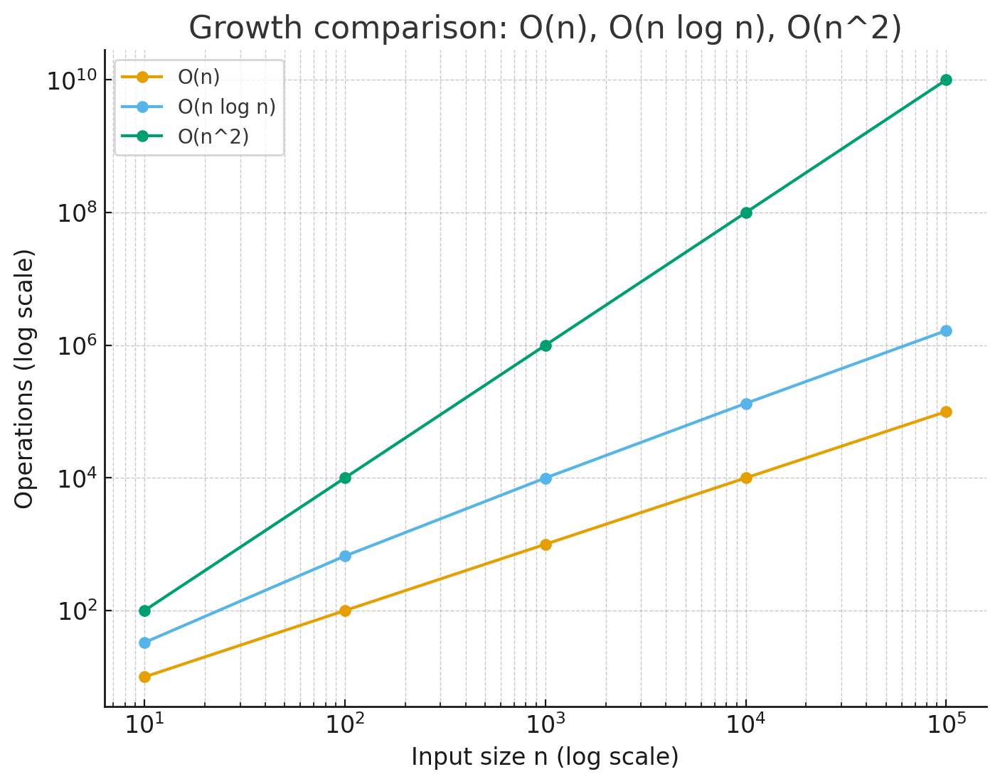

# 시간복잡도

## Big-O 표기법이란?

- 알고리즘이 입력 크기(n)에 따라 얼마나 오래 걸리는지를 수학적으로 표현한 것
- 실제 “초 단위 시간”이 아니라, 성장 속도를 보는 것

## 종류

| 표기           | 이름          | 예시                        | 설명                                                  |
| -------------- | ------------- | --------------------------- | ----------------------------------------------------- |
| **O(1)**       | 상수 시간     | 배열의 인덱스로 값 가져오기 | 입력 크기와 상관없이 항상 일정한 시간                 |
| **O(log n)**   | 로그 시간     | 이분 탐색                   | 데이터 크기가 2배로 커져도 단계 수는 +1 정도만 늘어남 |
| **O(n)**       | 선형 시간     | 단순 for문 한 번            | 입력 크기만큼 시간이 걸림                             |
| **O(n log n)** | 선형로그 시간 | 병합 정렬, 퀵 정렬 평균     | n번 처리하면서 각 단계에서 log n 연산 필요            |
| **O(n²)**      | 제곱 시간     | 2중 for문                   | 입력 크기가 2배 → 시간은 4배                          |
| **O(2^n)**     | 지수 시간     | 부분집합 전부 탐색          | 입력 크기가 조금만 커져도 엄청 느려짐                 |

## O(log n)이란?

log는 보통 밑이 2 (log₂) => 보통 이분 탐색에서 쓰이기 때문

"한 번 할 때마다 탐색 범위가 반으로 줄어드는" 경우 즉, e.g) 이분 탐색(Binary Search)

길이가 16인 배열 → 1단계 후 8개, 2단계 후 4개, 3단계 후 2개, 4단계 후 1개 → log₂16 = 4 단계

**O(log n)** 은 빠른 알고리즘 (데이터 크기가 100만이어도 20번만에 끝남)

## 직관적인 비교

- O(1): 버튼 하나 누르는 것

- O(log n): 책에서 원하는 페이지 찾을 때 이분법(절반씩 펼쳐보기)

- O(n): 책을 처음부터 끝까지 다 읽기

- O(n²): 모든 페이지 쌍 비교하기 (예: 단어가 두 페이지에 동시에 있는지)

| n       | O(n)    | O(n log n) | O(n²)          |
| ------- | ------- | ---------- | -------------- |
| 10      | 10      | 33         | 100            |
| 100     | 100     | 664        | 10,000         |
| 1,000   | 1,000   | 9,965      | 1,000,000      |
| 10,000  | 10,000  | 132,877    | 100,000,000    |
| 100,000 | 100,000 | 1,660,964  | 10,000,000,000 |

 

- 파란색 O(n): 거의 직선적으로 올라감 (완만)
- 주황색 O(n log n): O(n)보다 빠르게 커지지만 그래도 완만
- 초록색 O(n²): 급격하게 치솟음
