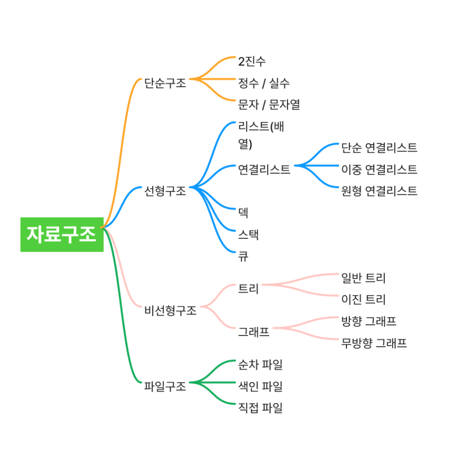

# 1. 스택(Stack)

## 개념

마지막에 들어간 것이 가장 먼저 나오는 구조 (LIFO: Last In, First Out) <br/>
e.g) 브라우저 뒤로가기

## JS 내장 메소드

- push()
  - 맨 뒤에 원소 추가
  - 원본 배열이 바뀜
- pop()
  - 맨 뒤에 원소 꺼내기
  - 원본 배열이 바뀜

> 🔅참고🔅 <br/>
> stack.peek(); => Java 메서드, 맨 위 값만 확인 <br/>
> stack.top(); => C++ 메서드, 맨 위 값만 확인

```js
const stack = [];
stack.push(1); // 넣기
stack.push(2);
console.log(stack.pop()); // 2
console.log(stack.pop()); // 1
```

# 2. 큐(Queue)

## 개념

먼저 들어간 것이 먼저 나옴 (FIFO: First In, First Out) <br/>
→ 대기열, 프린터 문제 등에서 사용

## JS 내장 메소드

- shift()
  - 원본 배열이 바뀜

```js
const queue = [];
queue.push(1);
queue.push(2);
console.log(queue.shift()); // 1
console.log(queue.shift()); // 2
```

# 3. 해시(Hash)

## 개념

- 키(key) → 값(value) 을 빠르게 매핑(저장/검색) 하기 위한 방식
- 키를 해시 함수로 변환해서 빠르게 값에 접근하는 방식
- Map, Object, Set 해시 테이블을 기반으로 동작

# 4. 힙(Heap)

## 개념

최댓값/최솟값을 빨리 꺼내기 위해 만든 자료구조

- JS에는 내장 힙이 없어서 보통 PriorityQueue 직접 구현해야 함.
- 레벨2~3부터 힙을 써야 하는 문제(예: "더 맵게")가 나옴.
- 항상 최소/최대 값을 O(log n)에 꺼낼 수 있는 구조.

# 5. 정렬(Sorting)

## 개념

데이터를 특정 기준으로 순서대로 나열

## 자주 쓰는 정렬 알고리즘

- 버블/삽입/선택 정렬: 기본적인 O(n²) 알고리즘 (학습용)
- 퀵/병합 정렬: O(n log n), 실제로 많이 씀

## JS 내장 메소드

- sort()

```js
const arr = [3, 1, 4, 2];
arr.sort((a, b) => a - b); // [1,2,3,4]
```

## 자주 출제 되는 문제

- "가장 큰 수" 문제 (숫자 정렬 응용)
- "K번째 수" 문제

# 6. 동적 계획법(DP: Dynamic Programming)

## 개념

큰 문제를 작은 문제로 쪼개서 풀고, 그 결과를 저장해두는 방법<br/>
핵심은 **중복 계산을 줄인다** (메모이제이션, 테이블)

## 자주 쓰는 정렬 알고리즘

피보나치 수열

- 재귀 => 비효율

  ```js
  function fib(n) {
    if (n <= 1) return n;
    return fib(n - 1) + fib(n - 2);
  }
  ```

- DP => 효율적

        ```js
        function fib(n) {
        const dp = [0, 1];
        for (let i = 2; i <= n; i++) {
        dp[i] = dp[i-1] + dp[i-2];
        }
        return dp[n];
        }
        ```

# 7. 탐욕법(Greedy)

## 개념

매 순간 "지금 가장 좋아 보이는 선택"을 해서 최적해를 구하는 방법.

## 자주 출제 되는 문제

- 거스름돈 문제 (큰 동전부터 차례대로 줌)
- 프로그래머스 “체육복” 문제 (앞뒤 학생에게만 빌려줌)

# 8. 완전탐색(Brute Force)

## 개념

가능한 모든 경우의 수를 전부 확인해서 정답을 찾는 방법.

# 9. 깊이/너비 우선 탐색 (DFS / BFS)

## 개념

- DFS (Depth First Search): 한 갈래를 끝까지 들어갔다가 막히면 돌아와서 다른 갈래 탐색. (스택/재귀로 구현)
- BFS (Breadth First Search): 시작점에서 가까운 노드부터 차례로 탐색. (큐로 구현)

## 자주 출제 되는 문제

- 미로 찾기 → BFS
- 트리 순회 → DFS

```js
// DFS 예시 (재귀)
function dfs(node, visited, graph) {
  visited[node] = true;
  for (let next of graph[node]) {
    if (!visited[next]) dfs(next, visited, graph);
  }
}

// BFS 예시 (큐)
function bfs(start, graph) {
  const visited = Array(graph.length).fill(false);
  const queue = [start];
  visited[start] = true;

  while (queue.length) {
    const node = queue.shift();
    for (let next of graph[node]) {
      if (!visited[next]) {
        visited[next] = true;
        queue.push(next);
      }
    }
  }
}
```

# 10. 이분탐색(Binary Search)

## 개념

정렬된 배열에서 원하는 값을 빠르게 찾는 방법. <br/>
범위를 절반씩 줄여가면서 탐색 (O(log n)).

```js
function binarySearch(arr, target) {
  let left = 0,
    right = arr.length - 1;
  while (left <= right) {
    const mid = Math.floor((left + right) / 2);
    if (arr[mid] === target) return mid;
    if (arr[mid] < target) left = mid + 1;
    else right = mid - 1;
  }
  return -1;
}
```

## 자주 출제 되는 문제

- 숫자 맞추기 게임 (업다운)

# 11. 그래프(Graph)

## 개념

정점(node)과 간선(edge)으로 이루어진 자료구조.

**종류**

- 방향 그래프 / 무방향 그래프
- 가중치 그래프 (거리, 비용이 있음)

**표현 방법**

- 인접 행렬: 2차원 배열
- 인접 리스트: 배열 안에 연결된 노드 목록

## 자주 출제 되는 문제

- 네트워크, 친구 관계, 도로 지도

> https://www.codetree.ai/blog/%EC%95%8C%EA%B3%A0%EB%A6%AC%EC%A6%98%EA%B3%BC-%EC%9E%90%EB%A3%8C%EA%B5%AC%EC%A1%B0-%EC%B0%A8%EC%9D%B4-%EA%B0%9C%EB%85%90%EA%B3%BC-%EC%A2%85%EB%A5%98-%ED%95%99%EC%8A%B5-%EB%B0%A9%EB%B2%95%EA%B3%BC/
