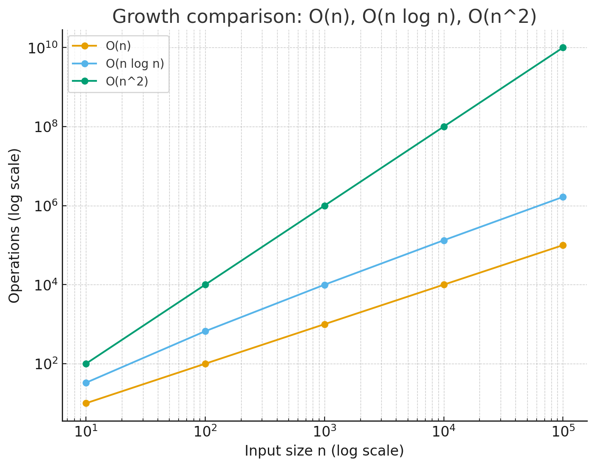

# 시간복잡도

## 개념

- 알고리즘이 입력 크기($N$)에 따라 얼마나 오래 걸리는지를 수학적으로 표현한 것

## Big-O 표기법이란?

- 알고리즘의 최대 실행 시간을 나타낸 것

## 종류

| 표기              | 이름          | 예시                        | 설명                                                  |
| ----------------- | ------------- | --------------------------- | ----------------------------------------------------- |
| **$O(1)$**        | 상수 시간     | 배열의 인덱스로 값 가져오기 | 입력 크기와 상관없이 항상 일정한 시간                 |
| **$O(\log N)$**   | 로그 시간     | 이분(이진) 탐색             | 데이터 크기가 2배로 커져도 단계 수는 +1 정도만 늘어남 |
| **$O(N)$**        | 선형 시간     | 단순 for문 한 번            | 입력 크기만큼 시간이 걸림                             |
| **$O(N \log N)$** | 선형로그 시간 | 병합 정렬, 퀵 정렬 평균     | n번 처리하면서 각 단계에서 log n 연산 필요            |
| **$O(N^2)$**      | 제곱 시간     | 2중 for문                   | 입력 크기가 2배 → 시간은 4배                          |
| **$O(2^n)$**      | 지수 시간     | 부분집합 전부 탐색          | 입력 크기가 조금만 커져도 엄청 느려짐                 |

### 1. $O(1)$ 상수 시간(Constant)

데이터가 1개든 100만개든 처리 시간이 같습니다.
처리 횟수는1

- 예시: 배열에서 주어진 인덱스 이용하여 값 찾기, 객체, Map, Set에서 값 꺼내기

```js
const arr = [1, 2, 3, 4, 5, ...1000000];
console.log(arr[0]); // 바로 찾음
```

### 2. $O(\log N)$ 로그 시간(Logarithmic)

연산을 거칠 때 마다 절반씩 줄어듭니다.(이분(이진) 탐색)

- 예시: 업다운 게임에서 절반씩 나눠서 확인 후 숫자를 구하는 방식

### 3. $O(N)$ 선형 시간(Linear)

데이터 개수만큼 연산 횟수가 늘어납니다.

- 예시: for문 한 번 돌기, Array.find(), filter(), map()

```js
const items = [1, 2, 3, 4, 5];
items.forEach((item) => console.log(item)); // (데이터 개수만큼)5번 실행
```

### 4. $O(N \log N)$ 선형 로그 시간

- 예시: Array.prototype.sort()

### 5. $O(N^2)$ 2차 시간(Quadratic)

중첩 반복문입니다. 데이터가 조금만 많아져도 브라우저가 멈추기 시작합니다.

- 예시: 이중 for문, 배열 안에서 indexOf나 includes를 반복해서 쓰는 경우

```js
// 데이터 1,000개면 1,000,000번 실행
for (let i = 0; i < n; i++) {
  for (let j = 0; j < n; j++) {
    ...
  }
}
```

### 6. $O(2^n)$ 지수 시간(Exponential Time)

데이터가 하나 늘어날 때마다 걸리는 시간이 배로 증가하는 구조 입니다.

- 예시: 피보나치 수열

```js
function fibonacci(n) {
  if (n <= 1) return n;
  // 호출될 때마다 함수가 2개씩 자기 자신을 호출함 (지수적으로 증가)
  return fibonacci(n - 1) + fibonacci(n - 2);
}

fibonacci(40);
```

> 데이터 10개: $2^{10}$ = 1,024번 연산 <br/>
> 데이터 20개: $2^{20}$ = 1,048,576번 연산 (약 100만 번) <br/>
> 데이터 30개: $2^{30}$ = 1,073,741,824번 연산 (약 10억번)

## 직관적인 비교

- O(1): 버튼 하나 누르는 것

- O(log n): 책에서 원하는 페이지 찾을 때 이분법(절반씩 펼쳐보기)

- O(n): 책을 처음부터 끝까지 다 읽기

- O(n²): 모든 페이지 쌍 비교하기 (예: 단어가 두 페이지에 동시에 있는지)

| n       | O(n)    | O(n log n) | O(n²)          |
| ------- | ------- | ---------- | -------------- |
| 10      | 10      | 33         | 100            |
| 100     | 100     | 664        | 10,000         |
| 1,000   | 1,000   | 9,965      | 1,000,000      |
| 10,000  | 10,000  | 132,877    | 100,000,000    |
| 100,000 | 100,000 | 1,660,964  | 10,000,000,000 |

<br/>



- 파란색 O(n): 거의 직선적으로 올라감 (완만)
- 주황색 O(n log n): O(n)보다 빠르게 커지지만 그래도 완만
- 초록색 O(n²): 급격하게 치솟음
